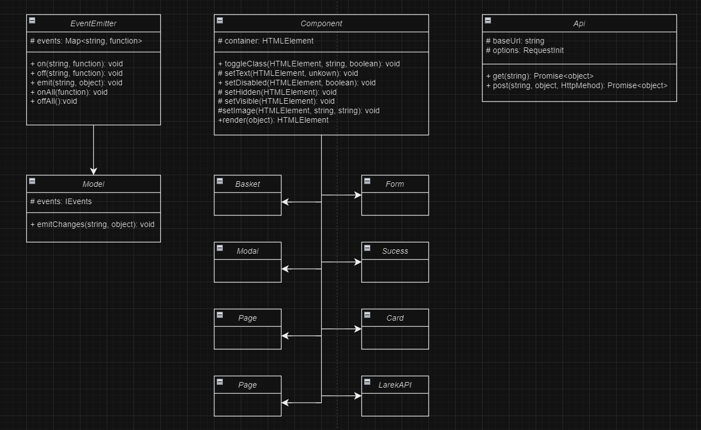

# Проектная работа "Веб-ларек"

Стек: HTML, SCSS, TS, Webpack

Структура проекта:
- src/ — исходные файлы проекта
- src/components/ — папка с JS компонентами
- src/components/base/ — папка с базовым кодом

Важные файлы:
- src/pages/index.html — HTML-файл главной страницы
- src/types/index.ts — файл с типами
- src/index.ts — точка входа приложения
- src/styles/styles.scss — корневой файл стилей
- src/utils/constants.ts — файл с константами
- src/utils/utils.ts — файл с утилитами

## Установка и запуск
Для установки и запуска проекта необходимо выполнить команды

```
npm install
npm run start
```

или

```
yarn
yarn start
```
## Сборка

```
npm run build
```

или

```
yarn build
```

# Архитектура


# Базовый код
## 1. Класс EventEmitter
Реализует паттерн «Наблюдатель» и позволяет подписываться на события и уведомлять подписчиков о наступлении события.
### **Методы:** 
- on - подписка на событие;
- off - отписка от события;
- emit - уведомление подписчика о наступлении события;
- onAll - подписка на все события;
- offAll - сброс всех событий;
- trigger - генерация заданного событие с заданным аргументом;

## 2. Класс Component
Инструментарий для работы с DOM-элементами.
### **Методы:**
- toggleClass - переключает класс элемента;
- setText - устанавливает текстовое содержимое элемента;
- setDisabled - меняет статус блокировки "disabled";
- setHidden - скрывает элемент;
- setVisible - показывает элемент;
- setImage - устанавливает изображение с альтернативным текстом;
- render - возвращает элемент в контейнер;

## 3. Класс Model 
Абстрактный класс для всех моделей данных.
### **Методы:**
- emitChanges - сообщает, что модель поменялась;

## 4. Класс Api
Отвечает за отправку HTTP-запросов и обработку данных от сервера.
### **Методы:**
- get - выполняет GET запрос к указанному адресу;
- post - выполняет POST запрос по указанному адресу;

# Общие компоненты
## 1. Класс Modal
Управляет поведением модальных окон.
### **Методы:**
- set content - наполняет содержимом модальное окно;
- open - открывает модальное окно;
- close - закрывает модальное окно;
- render - рендерит модальное окно;

## 2. Класс Form 
Управляет формами в проекте.
### **Методы:**
- onInputChange - информирует об изменении значения поля ввода;
- set valid - управляет состоянием кнопки;
- set errors - отображает текстовую ошибку, если поле не прошо валидность;
- render - рендерит форму;

## 3. Класс Basket
Управляет отображением корзины и ее состоянием.
### **Методы:**
- set items - устанавливает эллементы в корзине;
- set total - отображает стоимость товара в корзине;

## 4. Класс Sucess
Отображает модальное окно об успешном заказе.

# Классы предметной области
## 1. Класс Page
Управляет основными элементами страницы.

## 2. Класс Card
Управляет отображением информации о продукте. 

## 3. Класс LarekAPI 
Взаимодействует с сервером.
