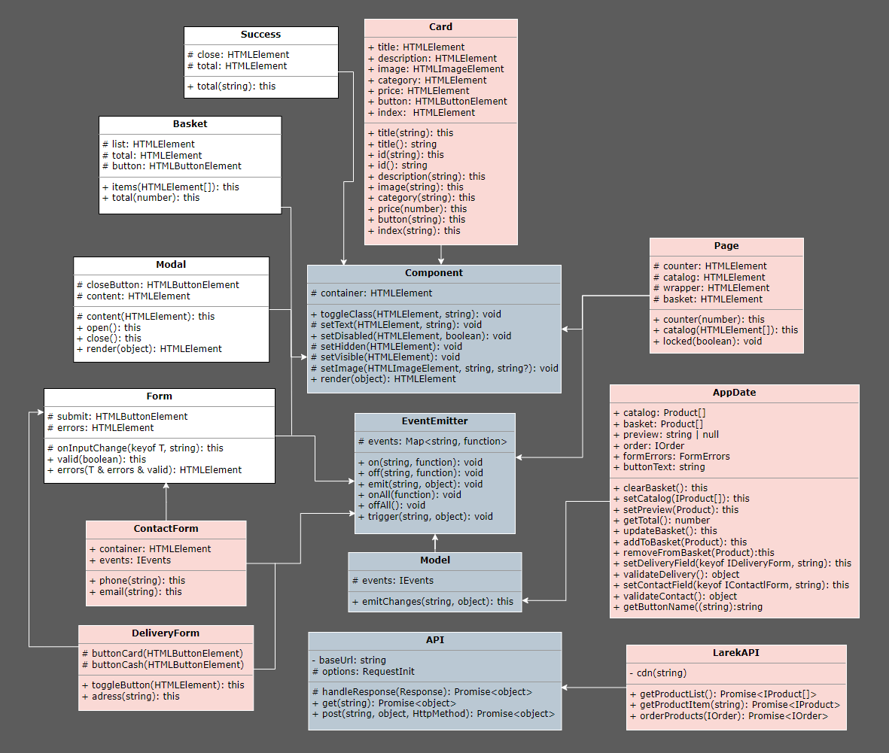

# Проектная работа "Веб-ларек"

Стек: HTML, SCSS, TS, Webpack

Структура проекта:
- src/ — исходные файлы проекта
- src/components/ — папка с JS компонентами
- src/components/base/ — папка с базовым кодом

Важные файлы:
- src/pages/index.html — HTML-файл главной страницы
- src/types/index.ts — файл с типами
- src/index.ts — точка входа приложения
- src/styles/styles.scss — корневой файл стилей
- src/utils/constants.ts — файл с константами
- src/utils/utils.ts — файл с утилитами

## Установка и запуск
Для установки и запуска проекта необходимо выполнить команды

```
npm install
npm run start
```

или

```
yarn
yarn start
```
## Сборка

```
npm run build
```

или

```
yarn build
```

# Архитектура


# Базовый код

### 1. Класс EventEmitter
Реализует паттерн «Наблюдатель» и позволяет подписываться на события и уведомлять подписчиков о наступлении события.

**Методы:** 
- on - подписка на событие;
- off - отписка от события;
- emit - уведомление подписчика о наступлении события;
- onAll - подписка на все события;
- offAll - сброс всех событий;
- trigger - генерация заданного событие с заданным аргументом;

### 2. Класс Component
Инструментарий для работы с DOM-элементами.

**Методы:**
- toggleClass - переключает класс элемента;
- setText - устанавливает текстовое содержимое элемента;
- setDisabled - меняет статус блокировки "disabled";
- setHidden - скрывает элемент;
- setVisible - показывает элемент;
- setImage - устанавливает изображение с альтернативным текстом;
- render - возвращает элемент в контейнер;

### 3. Класс Model 
Абстрактный класс для всех моделей данных.

**Методы:**
- emitChanges - сообщает, что модель поменялась;

### 4. Класс Api
Отвечает за отправку HTTP-запросов и обработку данных от сервера.

**Методы:**
- get - выполняет GET запрос к указанному адресу;
- post - выполняет POST запрос по указанному адресу;

# Общие компоненты
### 1. Класс Modal
Наследуется от класса ```Component```. Управляет поведением модальных окон.

<u>Конструктор класса:</u> 
```
container: HTMLElement, protected events: IEvents
```

**Методы:**
- set content - наполняет содержимом модальное окно;
- open - открывает модальное окно;
- close - закрывает модальное окно;
- render - рендерит модальное окно;

### 2. Класс Form 
Наследуется от класса ```Component```. Управляет формами в проекте.

<u>Конструктор класса:</u> 
```
protected container: HTMLFormElement, protected events: IEvents
```

**Методы:**
- onInputChange - информирует об изменении значения поля ввода;
- set valid - управляет состоянием кнопки;
- set errors - отображает текстовую ошибку, если поле не прошо валидность;
- render - рендерит форму;

### 3. Класс Basket
Наследуется от класса ```Component```. Управляет отображением корзины и ее состоянием.

<u>Конструктор класса:</u> 
```
container: HTMLElement, protected events: EventEmitter
```

**Методы:**
- set items - устанавливает эллементы в корзине;
- set total - отображает стоимость товара в корзине;

### 4. Класс Success
Наследуется от класса ```Component```. Отображает модальное окно об успешном заказе.

<u>Конструктор класса:</u> 
```
container: HTMLElement, actions: ISuccessActions
```

**Методы:**
- total - устанавливает значение общей суммы заказа;

# Классы предметной области
### 1. Класс Page
Наследуется от класса ```Component```.Управляет элементами страницы: счетчик корзины, каталог, блокировка страницы при открытии модального окна.

**Методы:**
- counter - устанавливает значение счетчика корзины;
- catalog - вывод каталог продуктов;
- locked - устанавливает блокировку прокрутки страницы;


### 2. Класс Card
Наследуется от класса ```Component```. Управляет отображением информации о продукте. 

**Методы:**
- set title - устанавливает заголовок продукта;
- get title - получает заголовок продукта;
- set id - устанавливает индификатор карточки;
- get id - получает индификатор карточки;
- set description - устанавливает описание продукта;
- set image - устанавливает изображение продукта;
- set category - устанавливает категорию продукта;
- set price - устанавливает цену продукта;
- set button - устанавливает текст кнопки;
- set index - устанавливает индекс продукта;

### 3. Класс LarekAPI 
Наследуется от класса ```Api```. Взаимодействует с сервером.

**Методы:**
- getProductList - получает список продуктов и их данные;
- getProductItem - получает данные продукта;
- orderProducts - отправляет заказ и получает ответ;

### 4. Класс AppData
Наследуется от класса ```Model```. Управляет состоянием приложения.

**Методы:**
- clearBasket - очищает корзину;
- setCatalog - устанавливает каталог продуктов;
- setPreview - устанавливает превью продукта с информацией;
- getTotal - получает общую стоимость продуктов в корзине;
- updateBasket - обновляет данные корзины;
- addToBasket - добавляет продукт в корзину;
- removeFromBasket - удаляет продукт из корзины;
- setDeliveryField - устанавливает значения полей для доставки заказа;
- validateDelivery - валидация формы доставки;
- setContactField - устанавливает значения полей для контактной формы;
- validateContact - валидация формы контактов;
- getButtonName - управляет значением кнопки;

### 5. Класс ContactForm
Наследуется от класса ```Form```. Управляет отображением формы контактов.

**Методы:**
- set phone - устанавливает номер телефона;
- set email - устанавливает email;

### 6. Класс DeliveryForm
Наследуется от класса ```Form```. Управляет отображением формы доставки.

**Методы:**
- toggleButtons - управляет состоянием кнопки оплаты;
- set address - устанавливает адрес доставки;
